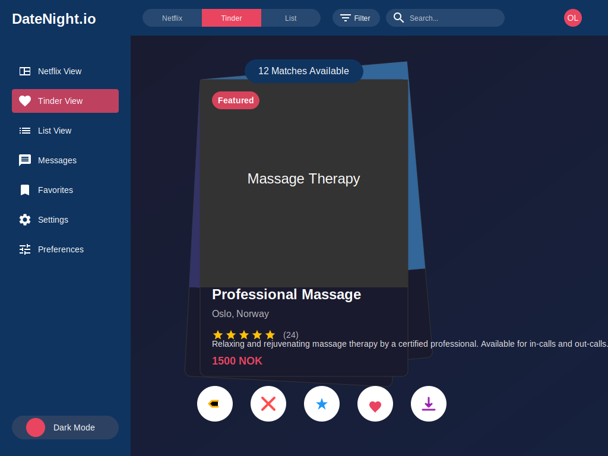
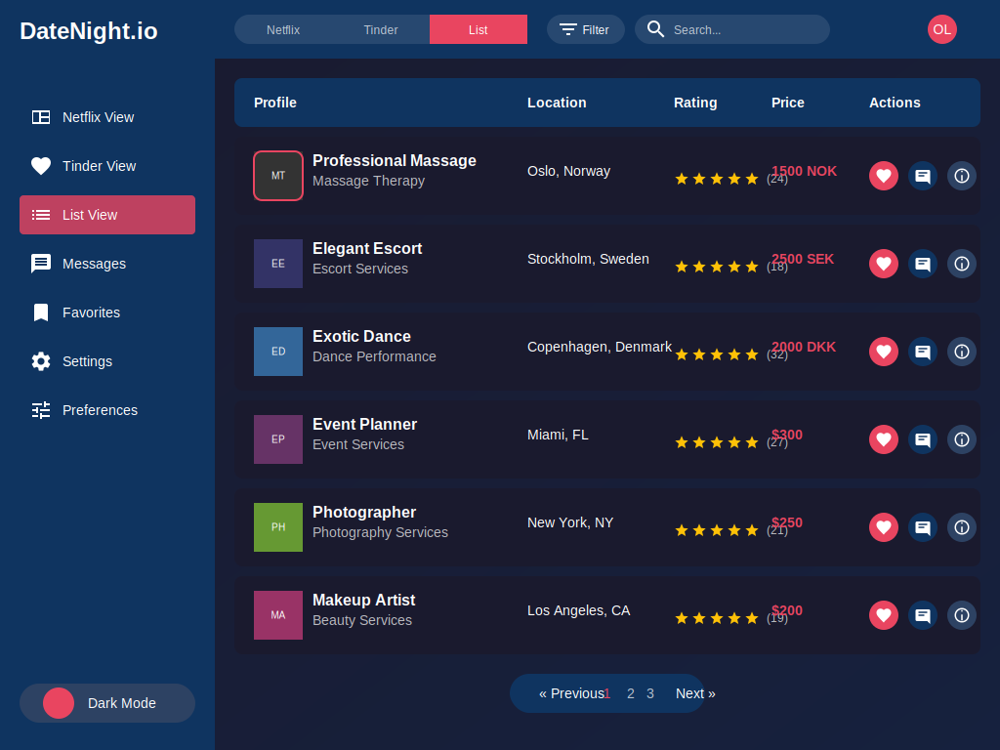
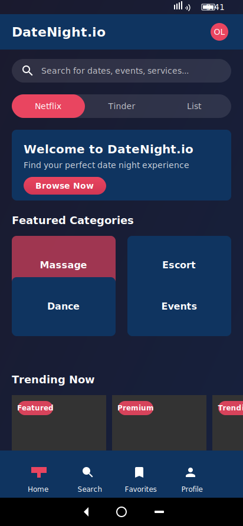

# DateNight.io UI Mockups

This directory contains high-fidelity SVG mockups for the DateNight.io application, showcasing the different views and responsive designs for both desktop and mobile platforms.

## Mockup Files

### Desktop Mockups (1024x768)

#### Desktop Tinder View

_Card-swiping browsing view (Tinder-style)_

#### Desktop List View

_Tabular browsing view (List-style)_

### Mobile Mockups

#### iPhone Home (390x844)

_Home page optimized for iPhone_

#### Android Home (412x892)

_Home page optimized for Android_

## Design System

### Color Palette

- **Primary Background**: Dark blue gradient (#1a1a2e to #16213e)
- **Secondary Background**: Darker blue (#0f3460)
- **Accent Color**: Pink/Red (#e94560)
- **Card Background**: Very dark blue (#1a1a2e)
- **Text**: White (#ffffff) with varying opacity for hierarchy
- **Rating Stars**: Gold (#ffc107)

### Typography

- **Desktop**: Arial font family
  - Headings: 20-28px, bold
  - Body text: 14-16px, regular
  - Small text: 12px
- **Mobile**:
  - iOS: SF Pro Text (system font)
  - Android: Roboto (system font)

### Components

#### Navigation

- **Desktop**: Left sidebar with icon + text navigation
- **Mobile**: Bottom tab bar with 4 primary actions

#### Cards

- Consistent card design across views with rounded corners (8px radius)
- Cards include:
  - Image/thumbnail area
  - Title and subtitle
  - Location information
  - Star rating with review count
  - Action buttons (like, chat, info)

#### Buttons

- Primary buttons: Pink gradient with white text
- Action buttons: Circular with icon
- Toggle buttons: Pill-shaped with selected state

## View Types

### Netflix View

- Grid-based layout showing multiple cards at once
- Cards organized in horizontal rows by category
- Each card shows a thumbnail, basic info, rating, and quick action buttons
- Optimized for browsing many options at once

### Tinder View

- Large card stack in the center of the screen
- One profile shown at a time with more detailed information
- Swipe/button actions for like, dislike, super like, etc.
- Optimized for quick yes/no decisions

### List View

- Tabular layout with consistent columns
- Shows more profiles at once in a compact format
- Includes sortable columns for different attributes
- Optimized for comparing multiple options

## Responsive Design

The mockups demonstrate how the UI adapts to different screen sizes:

### Desktop (1024x768)

- Full sidebar navigation
- Multi-column layout
- Larger cards with more information visible

### Mobile (iPhone/Android)

- Bottom tab navigation
- Single column layout
- Horizontally scrollable sections
- Optimized touch targets
- Platform-specific UI elements (status bar, home indicator, etc.)

## User Experience Considerations

### Consistency

- Consistent color scheme, typography, and component design across all views
- Unified navigation pattern
- Consistent card design with variations appropriate to each view

### Accessibility

- High contrast between text and backgrounds
- Clear visual hierarchy
- Appropriately sized touch targets on mobile
- Consistent iconography with labels

### Performance

- Card-based design allows for efficient loading and virtualization
- Clear loading states can be implemented
- Optimized image placeholders

## Implementation Notes

These SVG mockups are designed to be pixel-perfect representations of the final UI. When implementing:

1. Use a component-based architecture to maintain consistency
2. Implement responsive breakpoints to handle various screen sizes
3. Use CSS variables for the color palette to ensure consistency
4. Implement proper loading states and transitions between views
5. Ensure all interactive elements have appropriate hover/active states

The mockups use embedded SVG for illustrations, but in the actual implementation, these would be replaced with optimized images or icon fonts.
