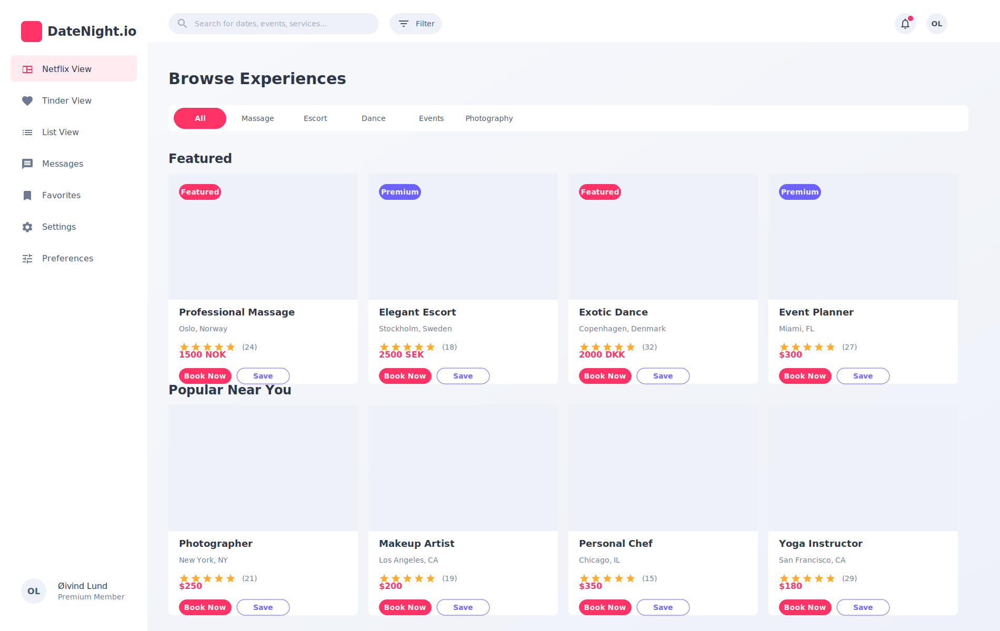
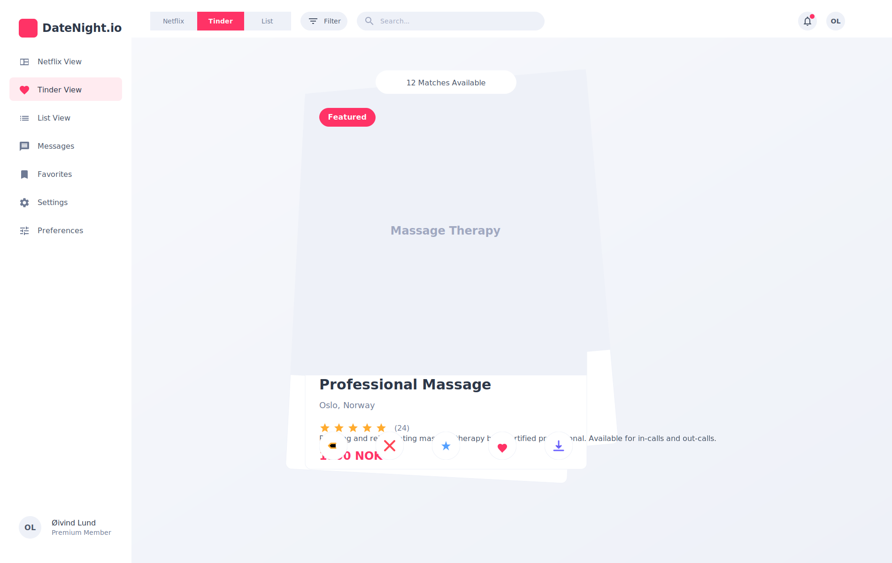
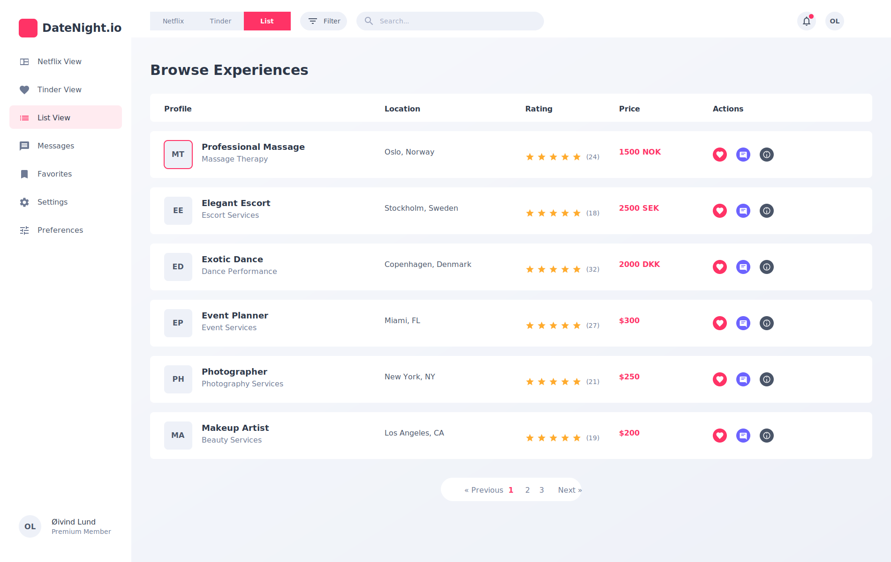
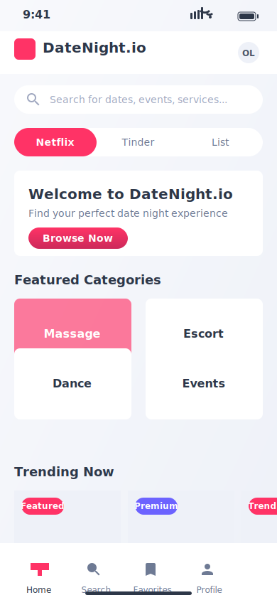
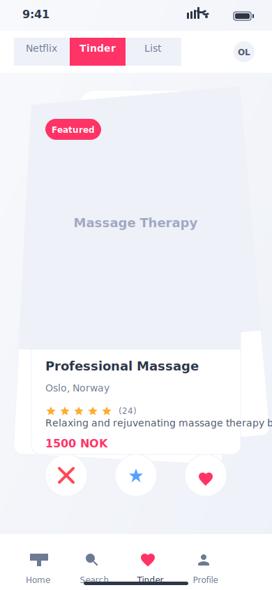
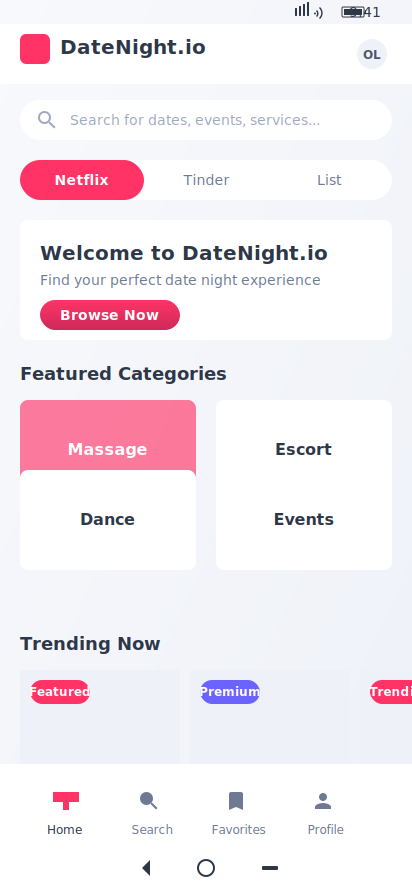

# DateNight.io UI Screenshots

This directory contains high-fidelity SVG screenshots for the DateNight.io application, showcasing the different views and responsive designs for both desktop and mobile platforms. These screenshots adhere to the styling guidelines specified in `docs/styling-guide.md`.

## Desktop Screenshots (1900x1200)

### Desktop Netflix View

_Grid-based browsing view (Netflix-style) with multiple cards displayed in a grid layout_

### Desktop Tinder View

_Card-swiping browsing view (Tinder-style) with a central card stack and action buttons_

### Desktop List View

_Tabular browsing view (List-style) with sortable columns for comparing options_

## Mobile Screenshots

### iPhone Home (390x844)

_Home page optimized for iPhone with iOS-specific UI elements_

### iPhone Tinder View (390x844)

_Card-swiping view optimized for iPhone with swipe actions_

### Android Home (412x892)

_Home page optimized for Android with Material Design influences_

## Design System Implementation

These screenshots implement the design system specified in the styling guide:

### Color Palette

**Primary Colors:**

- Primary: #ff3366 (Pink/Red)
  - Light: #ff6b99 (For hover states, backgrounds)
  - Dark: #cc295a (For active states, text on light backgrounds)

**Secondary Colors:**

- Secondary: #6c63ff (Purple)
  - Light: #9e97ff (For hover states, backgrounds)
  - Dark: #4a43cc (For active states, text on light backgrounds)

**Neutral Colors:**

- White: #ffffff
- Light Gray 1: #f8f9fc (Background, cards)
- Light Gray 2: #eef1f8 (Borders, dividers)
- Medium Gray 1: #d1d5e0 (Disabled states)
- Medium Gray 2: #a0a8c0 (Placeholder text)
- Dark Gray 1: #6e7a94 (Secondary text)
- Dark Gray 2: #4a5568 (Primary text)
- Dark Gray 3: #2d3748 (Headings)
- Black: #1a202c (Emphasis text)

**Semantic Colors:**

- Success: #38d9a9 (Green)
- Warning: #ffab2e (Orange)
- Error: #ff4757 (Red)
- Info: #54a0ff (Blue)

### Typography

**Font Families:**

- Primary (Body): 'Inter', sans-serif
- Headings: 'Poppins', sans-serif

**Font Weights:**

- Light: 300 (Used for large headings only)
- Regular: 400 (Default for body text)
- Medium: 500 (For emphasis and subheadings)
- Semibold: 600 (For buttons and important UI elements)
- Bold: 700 (For main headings and strong emphasis)

**Type Scale:**

- xs: 0.75rem (12px) - Small labels, footnotes
- sm: 0.875rem (14px) - Secondary text, captions
- base: 1rem (16px) - Body text, default size
- lg: 1.125rem (18px) - Large body text
- xl: 1.25rem (20px) - Subheadings
- 2xl: 1.5rem (24px) - H3, section headings
- 3xl: 1.875rem (30px) - H2, page subheadings
- 4xl: 2.25rem (36px) - H1, page titles
- 5xl: 3rem (48px) - Hero headings

## View Types

### Netflix View

- Grid-based layout showing multiple cards at once
- Cards organized in horizontal rows by category
- Each card shows a thumbnail, basic info, rating, and quick action buttons
- Optimized for browsing many options at once

### Tinder View

- Large card stack in the center of the screen
- One profile shown at a time with more detailed information
- Swipe/button actions for like, dislike, super like, etc.
- Optimized for quick yes/no decisions

### List View

- Tabular layout with consistent columns
- Shows more profiles at once in a compact format
- Includes sortable columns for different attributes
- Optimized for comparing multiple options

## Responsive Design

The screenshots demonstrate how the UI adapts to different screen sizes:

### Desktop (1900x1200)

- Full sidebar navigation
- Multi-column layout
- Larger cards with more information visible
- Ample whitespace for a premium feel

### Mobile (iPhone/Android)

- Bottom tab navigation
- Single column layout
- Horizontally scrollable sections
- Optimized touch targets
- Platform-specific UI elements (status bar, home indicator, etc.)

## Implementation Notes

These SVG screenshots are designed to be pixel-perfect representations of the final UI. When implementing:

1. Use a component-based architecture to maintain consistency
2. Implement responsive breakpoints to handle various screen sizes
3. Use CSS variables for the color palette to ensure consistency
4. Implement proper loading states and transitions between views
5. Ensure all interactive elements have appropriate hover/active states

The screenshots use embedded SVG for illustrations, but in the actual implementation, these would be replaced with optimized images or icon fonts.
