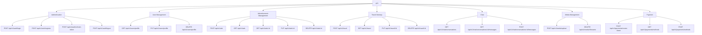

# API Endpoints

API endpoints for the Date Night App

```mermaid

graph TD
    API[API] --> Auth[Authentication]
    API --> Users[User Management]
    API --> Ads[Advertisement Management]
    API --> Travel[Travel Itinerary]
    API --> Chat[Chat]
    API --> Media[Media Management]
    API --> Payment[Payment]
    
    Auth --> Login[POST /api/v1/auth/login]
    Auth --> Register[POST /api/v1/auth/register]
    Auth --> RefreshToken[POST /api/v1/auth/refresh-token]
    Auth --> Logout[POST /api/v1/auth/logout]
    
    Users --> GetProfile[GET /api/v1/users/profile]
    Users --> UpdateProfile[PUT /api/v1/users/profile]
    Users --> DeleteUser[DELETE /api/v1/users/profile]
    
    Ads --> CreateAd[POST /api/v1/ads]
    Ads --> GetAds[GET /api/v1/ads]
    Ads --> GetAdById[GET /api/v1/ads/:id]
    Ads --> UpdateAd[PUT /api/v1/ads/:id]
    Ads --> DeleteAd[DELETE /api/v1/ads/:id]
    
    Travel --> AddLocation[POST /api/v1/travel]
    Travel --> GetLocations[GET /api/v1/travel]
    Travel --> UpdateLocation[PUT /api/v1/travel/:id]
    Travel --> DeleteLocation[DELETE /api/v1/travel/:id]
    
    Chat --> GetConversations[GET /api/v1/chat/conversations]
    Chat --> GetMessages[GET /api/v1/chat/conversations/:id/messages]
    Chat --> SendMessage[POST /api/v1/chat/conversations/:id/messages]
    
    Media --> UploadMedia[POST /api/v1/media/upload]
    Media --> DeleteMedia[DELETE /api/v1/media/:filename]
    
    Payment --> CreateIntent[POST /api/v1/payments/create-intent]
    Payment --> GetMethods[GET /api/v1/payments/methods]
    Payment --> AddMethod[POST /api/v1/payments/methods]

```
