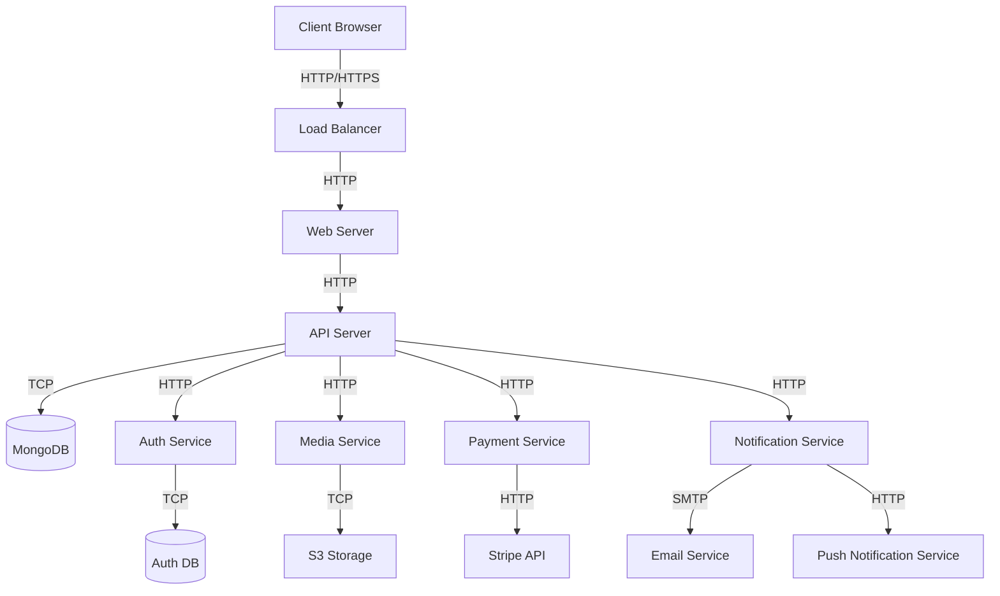

# System Architecture

High-level architecture of the Date Night App

```mermaid

graph TD
    Client[Client Browser] --> |HTTP/HTTPS| LB[Load Balancer]
    LB --> |HTTP| Web[Web Server]
    Web --> |HTTP| API[API Server]
    API --> |TCP| DB[(MongoDB)]
    API --> |HTTP| Auth[Auth Service]
    API --> |HTTP| Media[Media Service]
    API --> |HTTP| Payment[Payment Service]
    API --> |HTTP| Notification[Notification Service]
    Auth --> |TCP| AuthDB[(Auth DB)]
    Media --> |TCP| S3[S3 Storage]
    Payment --> |HTTP| Stripe[Stripe API]
    Notification --> |SMTP| Email[Email Service]
    Notification --> |HTTP| Push[Push Notification Service]

```
