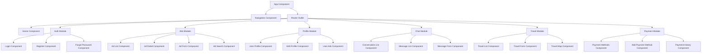

# Angular Component Hierarchy

Component hierarchy of the Angular client

```mermaid

graph TD
    App[App Component] --> Nav[Navigation Component]
    App --> Router[Router Outlet]
    Router --> Home[Home Component]
    Router --> Auth[Auth Module]
    Router --> Ads[Ads Module]
    Router --> Profile[Profile Module]
    Router --> Chat[Chat Module]
    Router --> Travel[Travel Module]
    Router --> Payment[Payment Module]
    
    Auth --> Login[Login Component]
    Auth --> Register[Register Component]
    Auth --> ForgotPassword[Forgot Password Component]
    
    Ads --> AdList[Ad List Component]
    Ads --> AdDetail[Ad Detail Component]
    Ads --> AdForm[Ad Form Component]
    Ads --> AdSearch[Ad Search Component]
    
    Profile --> UserProfile[User Profile Component]
    Profile --> EditProfile[Edit Profile Component]
    Profile --> UserAds[User Ads Component]
    
    Chat --> ConversationList[Conversation List Component]
    Chat --> MessageList[Message List Component]
    Chat --> MessageForm[Message Form Component]
    
    Travel --> TravelList[Travel List Component]
    Travel --> TravelForm[Travel Form Component]
    Travel --> TravelMap[Travel Map Component]
    
    Payment --> PaymentMethods[Payment Methods Component]
    Payment --> AddPaymentMethod[Add Payment Method Component]
    Payment --> PaymentHistory[Payment History Component]

```
