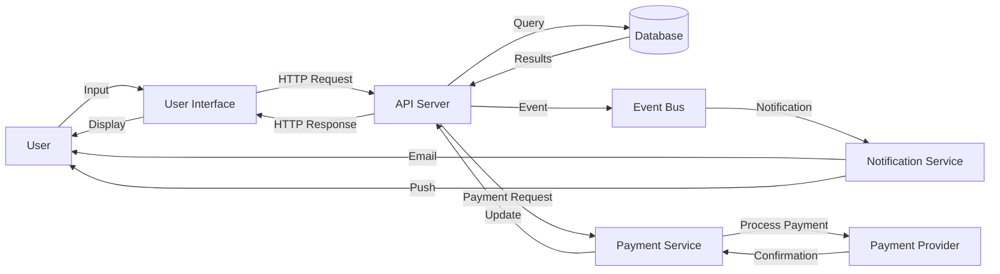

# Data Flow Diagram

Data flow in the Date Night App

```mermaid

graph LR
    User[User] --> |Input| UI[User Interface]
    UI --> |HTTP Request| API[API Server]
    API --> |Query| DB[(Database)]
    DB --> |Results| API
    API --> |HTTP Response| UI
    UI --> |Display| User
    
    API --> |Event| EventBus[Event Bus]
    EventBus --> |Notification| NotificationService[Notification Service]
    NotificationService --> |Email| User
    NotificationService --> |Push| User
    
    API --> |Payment Request| PaymentService[Payment Service]
    PaymentService --> |Process Payment| PaymentProvider[Payment Provider]
    PaymentProvider --> |Confirmation| PaymentService
    PaymentService --> |Update| API

```
