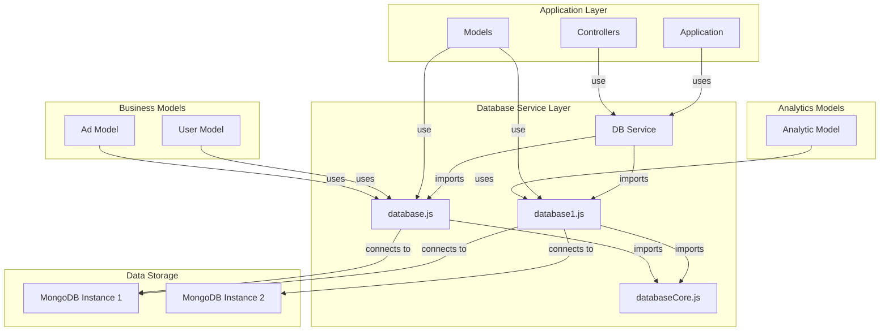

```mermaid
graph TD
    subgraph "Application Layer"
        App[Application]
        Models[Models]
        Controllers[Controllers]
    end

    subgraph "Database Service Layer"
        DB[DB Service]
        DB -->|imports| DB1[database1.js]
        DB -->|imports| Main[database.js]
        DB1 -->|imports| Core[databaseCore.js]
        Main -->|imports| Core
    end

    subgraph "Data Storage"
        MongoDB1[MongoDB Instance 1]
        MongoDB2[MongoDB Instance 2]
    end

    App -->|uses| DB
    Models -->|use| DB1
    Models -->|use| Main
    Controllers -->|use| DB
    DB1 -->|connects to| MongoDB1
    DB1 -->|connects to| MongoDB2
    Main -->|connects to| MongoDB1
    
    subgraph "Analytics Models"
        AnalyticModel[Analytic Model]
        AnalyticModel -->|uses| DB1
    end

    subgraph "Business Models"
        UserModel[User Model]
        AdModel[Ad Model]
        UserModel -->|uses| Main
        AdModel -->|uses| Main
    end
```
